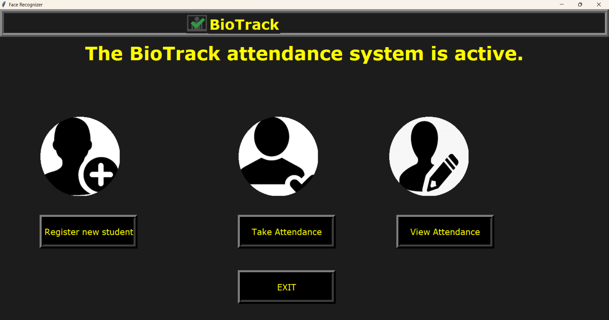
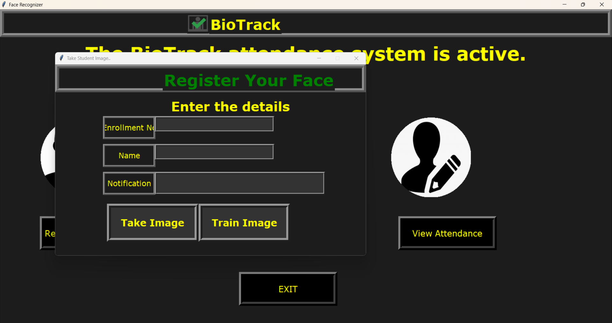
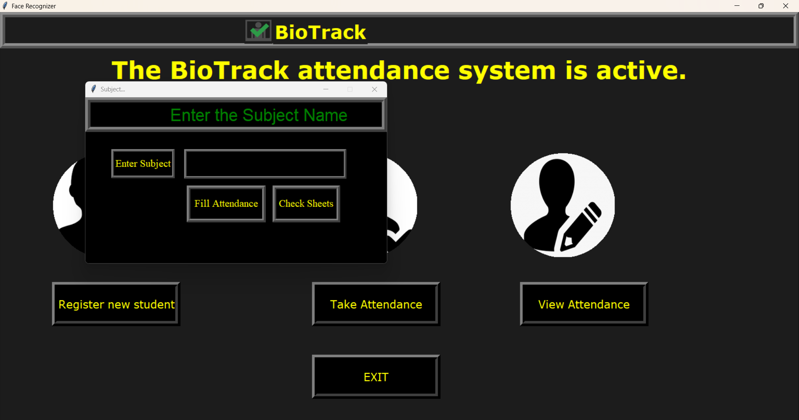
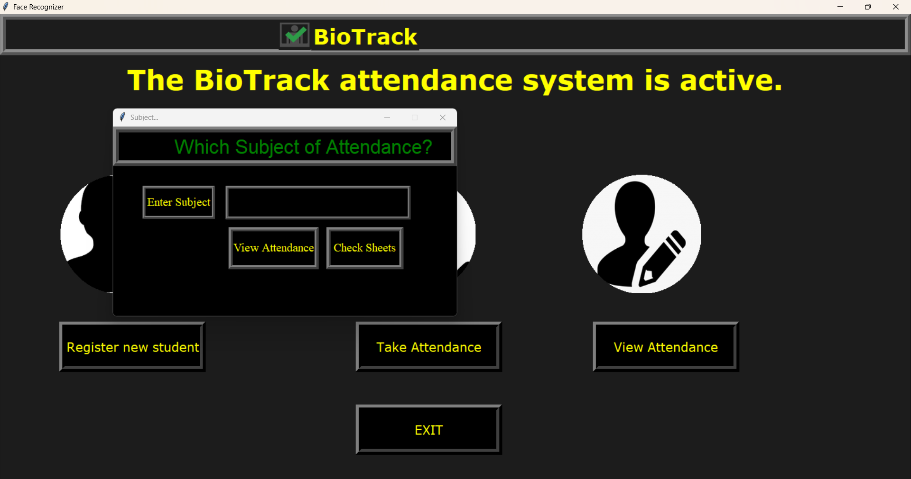

# 🎓 BioTrack: Face Recognition Attendance System

**BioTrack** is a robust, GUI-driven desktop application built with Python for automating the student attendance process. It utilizes **real-time face recognition** (LBPH) via **OpenCV** to efficiently record attendance, eliminating the need for traditional manual tracking.

***

## ✨ Features

* **GUI-driven Interface:** An intuitive user interface built with **Tkinter** for effortless navigation.
* **Student Registration:** Allows new users to register by capturing multiple face samples for training.
* **Model Training:** Trains the face recognition model (**LBPHFaceRecognizer**) on the captured image data.
* **Automatic Attendance:** Marks attendance for recognized students in real-time from a live camera feed.
* **Data Management:** Attendance records are stored in subject-wise **CSV files** (e.g., `Attendance/Subject/`).
* **Attendance Reports:** Calculates and displays the final attendance percentage for students across a chosen subject.
* **Manual Override:** Includes a feature to manually enter or correct attendance records (via `takemanually.py`).
* **Audio Feedback:** Uses `pyttsx3` to provide voice notifications for successful operations or errors.

***

## 🛠️ Technologies & Dependencies

| Technology | Role |
| :--- | :--- |
| **Python 3.x** | Core language. |
| **OpenCV (`cv2`)** | Face detection (Haar Cascades) and recognition (LBPH). |
| **Tkinter** | Building the Graphical User Interface (GUI). |
| **Pandas & NumPy** | Data manipulation and numerical operations for attendance files and image arrays. |
| **`pyttsx3`** | Text-to-Speech functionality. |

### Installation

1.  **Clone the repository:**
    ```bash
    git clone [https://github.com/YourUsername/BioTrack-Face-Recognition-Attendance.git](https://github.com/YourUsername/BioTrack-Face-Recognition-Attendance.git)
    cd BioTrack-Face-Recognition-Attendance
    ```

2.  **Install dependencies:**
    ```bash
    pip install opencv-python numpy pandas pillow pyttsx3
    ```

***

## 🚀 Setup and Usage Guide

### Initial Setup

You must create the following essential folders in the project's root directory. These folders are required for the system to store student data, training images, and attendance records:

* `StudentDetails`
* `TrainingImage`
* `TrainingImageLabel`
* `Attendance`

Ensure the Haar Cascade XML files (`haarcascade_frontalface_default.xml` and `haarcascade_frontalface_alt.xml`) are also in the root directory.

### Running the Application

Start the main application using the primary Python file:

```bash
python attendance.py
```

## ➡️ Core Workflow
1. **Register:** Use the "Register new student" option to enter the student's Enrollment Number and Name, and capture face samples (typically 50+ images).

2. **Train:** Click "Train Image" to train the facial recognition model using the new images. This step is mandatory after any new registration.

3. **Take Attendance:** Click "Take Attendance", enter the subject name, and the system will automatically start recognizing faces and marking attendance for the day.

4. **View Report:** Use "View Attendance" to aggregate all daily records and display the final attendance percentage for a subject.

## 📁 Project Files Overview

|File Name |Function |
| :--- | :--- |
|**attendance.py**|	The main file, containing the primary BioTrack GUI and application flow.|
|**takeImage.py**|	Handles face sample capture for new student enrollment.|
|**trainImage.py**|	Executes the LBPH algorithm to train the face recognition model.|
|**automaticAttedance.py**|	Core module for real-time face detection, recognition, and writing daily attendance to CSV.|
|**show_attendance.py**|	Reads and processes all daily CSV files to generate the final attendance report.|
|**takemanually.py**|	Module for manually correcting or entering attendance records.|
|**haarcascade_*.xml**|	Pre-trained XML files used by OpenCV for Haar Cascade face detection.|

 

## 📸 Project Snapshots:

*   **Simple UI:**



*   **Register New Student:**



*   **Take Attendance:**



*   **View Attendance:**

 

 

## **Support the Project:  Your support is highly appreciated! Please consider starring ⭐ this repository.**
